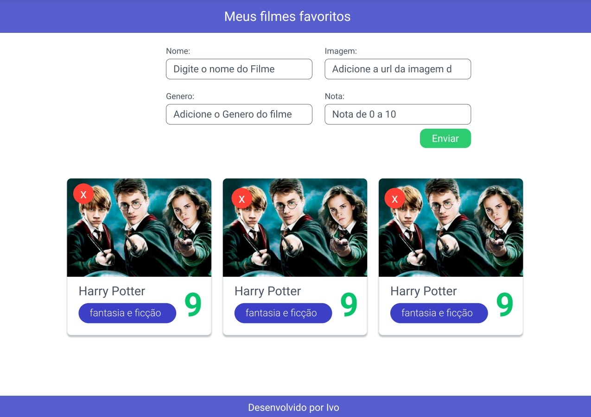

# Aula 3 - Desafio 'Meus Filmes'

Durante a aula 3 realizamos o fechamento da primeira parte do Todo-List com javascript
desenvolvido na aula 02 e inicializamos o desenvolvimento de um novo desafio, uma listagem de filmes em javascript puro.

## Proposta do desafio

A proposta do desafio é o desenvolvimento de uma aplicacao web para cadastro de filmes, onde seja possivel incluir um novo filme com os campos: nome do filme, genero, imagem e uma nota de 0 a 10.
A proposta de layout para o projeto deve seguir o prototipo desenvolvido no figma segundo a imagem abaixo. [Acesse o Prototipo](https://www.figma.com/file/MQSP4IMMmPyKGRWO4RYtk3/Blue-Filmes?node-id=0%3A1)



Exemplo de listagem de array no html

```js
let array = [];
const elementoLista = document.getElementById('lista');
console.log(elementoLista);
array.map((pessoa, indice) => {
  console.log(pessoa);
  elementoLista.insertAdjacentHTML('beforeend', `
    <div>
      <p>${pessoa.nome} ${pessoa.sobrenome}</p>
    <div>
  `)
})
```

outra forma de trabalhar com lista e pegar os dados do input

```js
let form = document.querySelector('.form');
let pessoas = [];
form.addEventListener('submit', (event) => {
  event.preventDefault();
  const inputNome = document.querySelector('#input-nome').value;
  const inputSobrenome = document.querySelector('#input-nome').value;
  const inputTelefone = document.querySelector('#input-nome').value;

  const pessoa = {
    nome: inputNome,
    sobrenome: inputSobrenome,
    telefone: inputTelefone,
  }
  pessoas.push(pessoa);

  const lista = document,.
  
  pessoas.map((pessoa, index) => {
    lista.insertAdjacentHTML('beforeend', `
      <p>${pessoa.nome}</p>
      <p>${pessoa.sobrenome}</p>
      <p>${pessoa.telefone}</p>
    `)
  })
})
```
