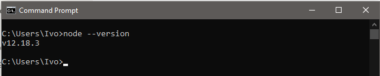

# Node.js

- [Node.js](#nodejs)
- [Introdução](#introdução)
- [Instalando o Node.js](#instalando-o-nodejs)
  - [Instalação no Windows](#instalação-no-windows)
  - [Instalação no Linux](#instalação-no-linux)
  - [Instalação no Mac](#instalação-no-mac)
- [NPM - Gerenciador de Pacotes do Node (*Node Package Manager*)](#npm---gerenciador-de-pacotes-do-node-node-package-manager)
  - [Como O NPM Funciona?](#como-o-npm-funciona)
  - [Package.json](#packagejson)
- [Estrutura inicial](#estrutura-inicial)
- [Exemplo prático](#exemplo-prático)
  - [1. Criando a Estrutura](#1-criando-a-estrutura)
  - [2. Instalando o express](#2-instalando-o-express)
  - [3. Criando o módulo inicial](#3-criando-o-módulo-inicial)
  - [4. Criando o servidor](#4-criando-o-servidor)
  - [5. Middlewares](#5-middlewares)
  - [5. HTTP](#5-http)
- [Referências e Material Extra](#referências-e-material-extra)
    - [Link Repositório de estudos](#link-repositório-de-estudos)
    - [Curso Gratuito nodeBR](#curso-gratuito-nodebr)
    - [O que é Node.js? (Vídeo)](#o-que-é-nodejs-vídeo)
    - [Podcast sobre node.js](#podcast-sobre-nodejs)
    - [Como construir uma Web API em Javascript sem frameworks (Vídeo)](#como-construir-uma-web-api-em-javascript-sem-frameworks-vídeo)
    - [O guia completo do package.json do Node.js](#o-guia-completo-do-packagejson-do-nodejs)
    - [O que são middlewares em NodeJS?](#o-que-são-middlewares-em-nodejs)
    - [Building a Simple REST API with Node.js and Express](#building-a-simple-rest-api-with-nodejs-and-express)
    - [Canal sobre Clean Architecture, TDD, SOLID principles e design patterns](#canal-sobre-clean-architecture-tdd-solid-principles-e-design-patterns)

# Introdução

O Node.js pode ser definido como um interpretador para execução Javascript server-side.
Como um ambiente de execução **[JavaScript](https://developer.mozilla.org/pt-BR/docs/Web/JavaScript)** assíncrono orientado a eventos, o Node.js é projetado para desenvolvimento de aplicações escaláveis de rede.

Quem pretende desenvolver alguma aplicação web node.js basicamente também deve saber como funciona a linguagem e a estrutura básica do **[JavaScript](https://developer.mozilla.org/pt-BR/docs/Web/JavaScript)**.

# Instalando o Node.js

Acesse o site do Node, [https://nodejs.org/en/](https://nodejs.org/en/). Assim que entrar no site, você verá dois botões, indicando duas versões para baixar (LTS e Current).

- **LTS** é uma versão que tem um suporte mais prolongado, porém, costuma ser mais antiga. Ela é focada em estabilidade e segurança. Essa versão é mais recomendada para grandes projetos, que precisam de uma versão mais estável e que não podem ficar sendo atualizados.
- Em contrapartida temos a **Current**, a versão mais atual com todas as novas funcionalidades, muito indicada para testes, estudos e novos projetos. Cada nova versão pode ter atualizações que podem quebrar um código que foi escrito em uma versão mais antiga. Portanto, é preciso tomar cuidado ao atualizar projetos para novas versões.

## Instalação no Windows

Logo após selecionar uma versão (LTS ou Current), será iniciado o download do instalador para Windows. Assim como é comum nos instaladores do Windows, basta seguir clicando nos botões Next até chegar ao final da instalação.

Em seguida, no terminal digite `node -version` ou `-v` e aperte a tecla enter. Caso seja exibida a versão do Node, sua instalação foi feita com sucesso!



## Instalação no Linux

Podemos instalar o Node.js facilmente com o próprio gerenciador de pacotes do Linux. Inicie o terminal pressionando Ctrl + Alt + T.

Em seguida, no terminal digite o comando:

```bash
sudo apt install nodejs
```

Em seguida, no terminal digite node -version ou -v e aperte a tecla Enter. Caso seja exibida a versão do Node, sua instalação foi feita com sucesso!

Em caso de duvidas sobre diferentes instalações de acordo com as versões do Linux é possível consultar na **[documentação oficial](https://nodejs.org/en/download/)**.

## Instalação no Mac

Logo após selecionar uma versão (LTS ou Current), será iniciado o download do instalador para Mac (arquivo .pkg). Assim que abrir esse arquivo, o instalador será iniciado.

Basta ir clicando para continuar até ele finalizar a instalação.

Em seguida, no terminal digite `node -version` ou `-v` e aperte a tecla enter. Caso seja exibida a versão do Node, sua instalação foi feita com sucesso!

# [NPM](https://www.npmjs.com/) - Gerenciador de Pacotes do Node (*Node Package Manager*)

Durante a instalação do node além do próprio node é instalado em sua maquina o **npm** que se trata de um gerenciador de pacotes do node e que é muito útil no desenvolvimento Node.

## Como O NPM [](https://www.npmjs.com/)Funciona?

O **NPM** funciona baseado nesses dois ofícios:

- Ele é um repositório amplamente usado para a publicação de projetos [open-source](https://www.totvs.com/blog/developers/como-funciona-um-software-open-source/) **Javascript**. Isso significa que ele é uma plataforma online onde qualquer pessoa pode publicar e compartilhar ferramentas escritas em **JavaScript**.
- O [**npm**](https://www.npmjs.com/) é uma ferramenta de linha de comando que ajuda a interagir com plataformas online, como navegadores e servidores. Essa utilidade auxilia na instalação e desinstalação de pacotes, gerenciamento da versões e gerenciamento de dependências necessárias para executar um projeto.

## Package.json

Ao iniciar uma aplicação via **npm** para usar os pacotes open-source, vai ser criado ou deve conter um arquivo chamado de **package.json** em seu projeto. Dentro do pacote, você encontrará metadados específicos para os projetos.

Os metadados do **package.json** mostram alguns aspectos do projeto na seguinte ordem:

- O nome do projeto;
- A versão inicial;
- A descrição;
- O ponto de entrada;
- Os comandos de script;
- O repositório **[git](https://www.hostinger.com.br/tutoriais/o-que-github/)**;
- As palavras-chave;
- A licença;
- As dependências;
- As dependências do desenvolvedor (**devDependencies**). (se houver)

Os metadados ajudam a identificar o projeto e agem como uma base para que os usuários obtenham as informações sobre ele.

Aqui tem um exemplo de como identificar um projeto por meio desses metadados:


- O **nome** é **projeto01-lista-de-filme.**
- A **versão** é **1.0.0**
- O **ponto de entrada do projeto** ou o arquivo principal é **index.js**.
- Os [scripts](https://wbruno.com.br/nodejs/package-json-entendendo-os-scripts/) de configuração do npm.
- O **autor** do projeto não tem, por isso em branco se houvesse estaria `"author": "nome do autor"`;
- Este projeto está **licenciado** sob o ISC.
- As **dependências** ou outros **módulos** que esse módulo usa são

    express 4.17.1 e node 16.5.0

- As **dependencias de desenvolvimento** são nodemon 2.0.12
- A descrição nesse caso está em branco, se houvesse estaria `"description": "texto da descricao"`

# Estrutura inicial

Inicialmente vamos criar o nosso **package.json** através do gerenciador de pacotes [**NPN**](https://cibersistemas.pt/tecnologia/o-que-e-npm-um-tutorial-do-node-package-manager-para-iniciantes/).

O **package.json** é uma espécie de manifesto do seu projeto. Ele pode fazer várias coisas, completamente não relacionadas. Ele é um repositório central de configurações de ferramentas, por exemplo. Ele também é onde **npm** armazena os nomes e versões dos pacotes instalados.

```bash
npm init -y
```

# Exemplo prático

## 1. Criando a Estrutura

Primeiro crie uma pasta de sua preferencia para sua aplicação de exemplo. Ex: meu-projeto.

Depois nós precisamos criar o nosso arquivo [**package.json**](https://www.luiztools.com.br/post/o-guia-completo-do-package-json-do-node-js/) esse é o arquivo de ponto de partido dos nossos projetos Node. Para isso, execute o comando a baixo. Ele irá criar o nosso arquivo com a referencia do module express.

```bash
npm init -y
```

## 2. Instalando o express

Em seguida instalamos o **[express](https://expressjs.com/pt-br/)** que é um framework rápido e um dos mais utilizados em conjunto com o Node.js, facilitando no desenvolvimento de aplicações back-end e até, em conjunto com sistemas de templates, aplicações full-stack.

```bash
npm install express
```

## 3. Criando o módulo inicial

Primeiro vamos criar o arquivo de entrada **index.js**

```jsx
// importacao do express e atribuicao em uma constante chamada express.
const express = require('express')

// inicializacao do express na constante app.
const app = express()

// Estamos dizendo ao Express para usar o modulo json.
app.use(express.json())

// exportacao do modulo caso necessario
module.exports = app
```

Aqui, simplesmente importamos o módulo do Express e atribuímos a uma constante chamada express e depois dizemos ao Node que a constante app será uma instância do Express.

Também estamos dizendo ao Express para usar o módulo json porque se você deseja passar informações do front-end para a API, sejam elas pequenas ou grandes, normalmente você as escreverá e as passará para a API no formato [JSON ( application/json)](https://developer.mozilla.org/pt-BR/docs/Web/JavaScript/Reference/Global_Objects/JSON).

`JSON` - JSON é uma sintaxe para serialização de objetos, matrizes, números, strings, booleanos, e null. Baseia-se em sintaxe Javascript, mas é distinta desta: alguns Javascript não são JSON, e alguns JSON não são Javascript.

`express.json()` é um método embutido no ***express*** para reconhecer o objeto de solicitação de entrada como um objeto JSON. Este método é chamado como um middleware em seu aplicativo usando o código: `app.use(express.json());`

Também iremos exportar apppara que possamos interagir com ele a partir de outro script.

## 4. Criando o servidor

Agora iremos criar um script separado para ativar o nosso servidor. **server.js**

```jsx
// importacao do app onde esta a configuracao do express.
const app = require('./index')

// criacao do servidor na porta 3000.
app.listen(3000, () => {
    console.log('Server running in http://127.0.0.1:3000')
})
```

Após isso, vamos executar em nosso terminal o comando node server.js:

```bash
node server.js
Server running in http://127.0.0.1:3000
```

## 5. Middlewares

O [**middleware**](https://pt.stackoverflow.com/questions/64507/o-que-s%C3%A3o-middlewares-em-nodejs) consistirá em instruções que a API deve seguir e **é importante que nosso middleware sempre retorne algo .**

## 5. HTTP

O protocolo HTTP define um conjunto de métodos de requisição responsáveis por indicar a ação a ser executada para um dado recurso. Embora esses métodos possam ser descritos como substantivos, eles também são comumente referenciados como HTTP Verbs (Verbos HTTP).

`GET`

O método GET solicita a representação de um recurso específico. Requisições utilizando o método GET devem retornar apenas dados.

`POST`

O método POST é utilizado para submeter uma entidade a um recurso específico, frequentemente causando uma mudança no estado do recurso ou efeitos colaterais no servidor.

`PUT`

O método PUT substitui todas as atuais representações do recurso de destino pela carga de dados da requisição.

`DELETE`

O método DELETE remove um recurso específico.

Saiba mais na [documentação](https://developer.mozilla.org/pt-BR/docs/Web/HTTP/Methods).

# Referências e Material Extra

Abaixo uma lista de links e referencias para continuar estudando node.js.

### Link Repositório de estudos

[Documentação (Oficial)](https://nodejs.org/en/docs/guides/)

### Curso Gratuito nodeBR

[Imersão em desenvolvimento de APIs com Node.js By #NodeBR!](https://erickwendel.teachable.com/p/node-js-para-iniciantes-nodebr)

### O que é Node.js? (Vídeo)

[https://www.youtube.com/watch?v=nfrVPzDJZQc&t=21s](https://www.youtube.com/watch?v=nfrVPzDJZQc&t=21s)

### Podcast sobre node.js

[Node.js - Hipsters #199 - Hipsters Ponto Tech](https://hipsters.tech/node-js-hipsters-199/)

### Como construir uma Web API em Javascript sem frameworks (Vídeo)

[https://www.youtube.com/watch?v=NxHY14rMPvc](https://www.youtube.com/watch?v=NxHY14rMPvc)

### O guia completo do package.json do Node.js

[O guia completo do package.json do Node.js](https://www.luiztools.com.br/post/o-guia-completo-do-package-json-do-node-js/)

### O que são middlewares em NodeJS?

[O que são middlewares em NodeJS?](https://pt.stackoverflow.com/questions/64507/o-que-s%c3%a3o-middlewares-em-nodejs)

### Building a Simple REST API with Node.js and Express

[Building a Simple REST API with Node.js and Express](https://dev.to/starkfire/building-a-simple-rest-api-with-node-js-and-express-299j)

### Canal sobre Clean Architecture, TDD, SOLID principles e design patterns

[MangoDeveloper](https://www.youtube.com/c/MangoDeveloper)
